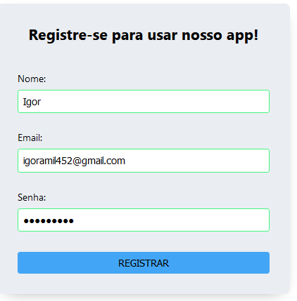

Autenticador de Login

[Clique aqui para acessar](https://igormolinals.github.io/Autenticador-de-login/)

Projeto construído durante o curso Full Stack Javascript da OneBitCode

Lembrando que o input de senha está com o tipo text, para que se possa ver o que foi colocado.

Os critérios para que sejam válidas as informações colocadas são: 
E-mail: no mínimo dois caracteres de a-z, maiúsculos ou não, seguidos por @ seguidos por no mínimo mais dois caracteres de a-z, maiúsculos ou não, seguidos por um . e mais dois caracteres de a-z, maiúsculos ou não.

Senha: Deve conter no mínimo 8 digitos, sendo necessárias no mínimo uma letra maiúscula, uma minúscula, um número e um caractere especial.

## Tecnologias

-HTML
 
-CSS
 
-JavaScript
 
-Git e Github

## Contato
igoramil452@gmail.com
 
https://www.linkedin.com/in/igor-molinals/